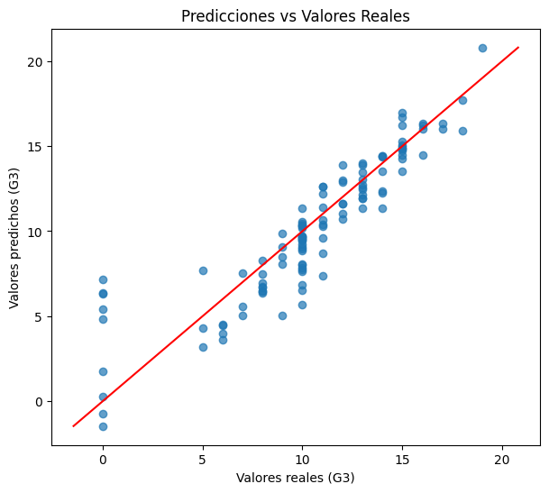
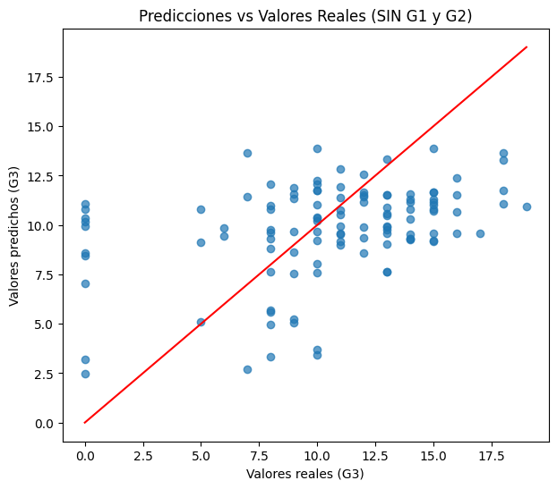

# Entrenamiento y evaluación del modelo

Como vimos en el modulo de limpieza y selección de caracteristicas, exploremos los dos escenarios donde
incluyamos un modelo donde incluyamos las calificaciones del primer y segundo periodo y uno donde no las incluyamos, 
esto para ver como varian nuestras metricas estadisticas y nuestros modelos bajo distintas condiciones.


## Regresión Lineal Multiple CON g1 y g2
Para estos dos datos, usemos el 70% de los datos originales ya que en si nuestro dataset de 380 observaciones, es
relativamente pequeño, de modo que hay que balancearlo, para el training de los dos casos, obteniendo datos como el pvalue, RSE, 
RSS, F statistic, antes y despues del training para ver como se comporta.

### Importar librerias y partir datos en train y test

>Python Code

```python
# Genera datos de entrenamiento
train = df.sample(frac = 0.7)
# Genera datos de validación
test = df.drop(train.index)
# Imprime dimensiones de datos de entrenamiento
print("Train:", train.shape)
# Imprime dimensiones de datos de prueba
print("Test:",test.shape)
# Imprime primeras 5 filas de datos de entrenamiento
print(train.head())

```


>Output


```text
Train: (266, 13)
Test: (114, 13)
     Edad  HorasDeEstudio  Reprobadas  Internet  Faltas  G1  G2  G3  Sexo_bin  \
206    16               2           3         1       5   7   7   7         1   
45     15               2           0         1       8   8   8   6         1   
349    18               1           1         1      10  11  13  13         0   
5      16               2           0         1      10  15  15  15         0   
244    18               3           0         1       0   7   0   0         1   

     Escuela_bin  Estudio_bajo  Estudio_moderado  Estudio_alto  
206            1             0                 1             0  
45             1             0                 1             0  
349            0             1                 0             0  
5              1             0                 1             0  
244            1             0                 1             0
```


### Entrenar Modelo


>Python Code


```python
# Importar librería
import statsmodels.api as sm
# Generar elemento X
X = train.drop('G3', axis = 1)
# Generar elemento Y
Y = train.G3
# Definir el tipo de modelo
model = sm.OLS(Y,sm.add_constant(X))
# Ajustar el modelo para obtener resultados
results = model.fit()
# Imprimir un resumen de los resultados
print(results.summary())
```


>Output


```text
                            OLS Regression Results                            
==============================================================================
Dep. Variable:                     G3   R-squared:                       0.845
Model:                            OLS   Adj. R-squared:                  0.838
Method:                 Least Squares   F-statistic:                     125.8
Date:                Thu, 05 Feb 2026   Prob (F-statistic):           4.78e-96
Time:                        01:44:20   Log-Likelihood:                -543.73
No. Observations:                 266   AIC:                             1111.
Df Residuals:                     254   BIC:                             1154.
Df Model:                          11                                         
Covariance Type:            nonrobust                                         
====================================================================================
                       coef    std err          t      P>|t|      [0.025      0.975]
------------------------------------------------------------------------------------
const                0.7331      1.563      0.469      0.639      -2.345       3.811
Edad                -0.2207      0.112     -1.974      0.049      -0.441      -0.001
HorasDeEstudio       0.3776      0.346      1.090      0.277      -0.305       1.060
Reprobadas          -0.4943      0.185     -2.671      0.008      -0.859      -0.130
Internet            -0.3600      0.323     -1.116      0.266      -0.995       0.275
Faltas               0.1197      0.024      4.906      0.000       0.072       0.168
G1                   0.1793      0.069      2.581      0.010       0.042       0.316
G2                   0.9475      0.060     15.790      0.000       0.829       1.066
Sexo_bin            -0.1572      0.257     -0.610      0.542      -0.664       0.350
Escuela_bin         -0.2535      0.414     -0.612      0.541      -1.070       0.562
Estudio_bajo         1.1770      0.647      1.819      0.070      -0.097       2.451
Estudio_moderado     0.5465      0.557      0.981      0.327      -0.551       1.644
Estudio_alto        -0.9904      0.891     -1.111      0.268      -2.746       0.765
==============================================================================
Omnibus:                      122.124   Durbin-Watson:                   1.969
Prob(Omnibus):                  0.000   Jarque-Bera (JB):              525.348
Skew:                          -1.911   Prob(JB):                    8.36e-115
Kurtosis:                       8.726   Cond. No.                     1.30e+17
==============================================================================

Notes:
[1] Standard Errors assume that the covariance matrix of the errors is correctly specified.
[2] The smallest eigenvalue is 8.75e-30. This might indicate that there are
strong multicollinearity problems or that the design matrix is singular.
```

Enhorabuena, vemos que tenemos una R^2 ajustada muy alta, de 0.838, lo cual nos dice que nuestro modelo explica el 83.8% del
conjunto de datos que tenemos, asi mismo podemos notar que hay ciertas variables las cuales debido a su pvalue, es probable 
que no aporten mucho al dataset, tales como, 'Escuela_bin', 'Sexo_bin'.


### Interpretacion de la tabla
De esta tabla de datos podemos interpretar lo siguiente:

- Edad: Un coeficiente negativo indica que, a mayor edad, la calificación tiende a bajar ligeramente.

- Repetición y acceso a internet: Si repites el año y tienes internet, eso también afecta negativamente la calificación.

- Escuela y sexo: La variable de sexo, con un coeficiente negativo para mujeres, muestra una diferencia de calificación, aunque pequeña.

- Horas de estudio: Lo interesante es que, en este caso, estudiar más no necesariamente mejora la calificación; al contrario, podría estar relacionado con una menor calificación.

Así mismo, podemos ver que las variables que practicamente tiene un p-val de 0, son faltas (algo extraño de encontrar) y G2, lo que nos
pued indicar que estas variables son importantes en nuestro dataset.


### Metricas Estadisticas (F-stat / p-val)


>Python Code


```python
import scipy.stats as st
yhat = results.predict(sm.add_constant(X))
ybar = np.mean(Y)
ESS = sum((yhat - ybar)**2)
m = X.shape[1]
EMS = ESS / m
RSS = sum((Y - yhat)**2)
n = X.shape[0]
RMS = RSS / (n - m - 1)
F = EMS / RMS
pval = st.f.sf(F, m, n - m - 1)
print("F =", F)
print("p-value =", pval)
```


>Output


```text
F = 114.83046878759362
p-value = 5.490568541948647e-95
```

Esto nos dice que en nuestro modelo, hay variables importantes y debido al pvalue pequeño,
la probabilidad de que esto sea al azar es bajisima, cosa que nos indica que vamos por buen camino.

Nota: Como las variables, Escuela_bin y Sexo_bin,  tirenen un pvalue de casi 50%, vamos a quitarlas y a definir un nuevo dataset sin esas variables


### Eliminar variables con p-val muy grande


>Python Code


```python
# generar nuevos modelos sin las variables con un pvalue muy grande
XNew = X.drop(['Escuela_bin','Sexo_bin'], axis = 1)
modelNew = sm.OLS(Y,sm.add_constant(XNew))
resultsNew = modelNew.fit()
```


Calcular metricas estadisticas para esas variables, para posteriormente usarlas 


>Python Code


```python
yhatNew = resultsNew.predict(sm.add_constant(XNew))
RSSNew = sum((Y-yhatNew)**2)
EMSNew = (RSSNew - RSS) / 1
FNew = EMSNew / RMS
pvalNew = st.f.sf(FNew, 1, n-m-1)
t = np.sqrt(FNew)
print("New F =", FNew)
print("t-value =", t)
print("p-value =", pvalNew)
print("OLS's p-value Escuela =", results.pvalues["Escuela_bin"])
print("OLS's p-value Sexo =", results.pvalues["Sexo_bin"])
```


>Output


```text
New F = 0.7352437702228594
t-value = 0.8574635678691307
p-value = 0.392000256699059
OLS's p-value Escuela = 0.5411805124962055
OLS's p-value Sexo = 0.5421269209145818
```


### Generar Nuevos elementos para la validacion


>Python Code


```python
# Genera el elemento XTest
XTest = test.drop('G3', axis = 1)
yhatTest = results.predict(sm.add_constant(XTest))
YTest = test.G3
RSSTest = sum((YTest-yhatTest)**2)
TSSTest = sum((YTest-np.mean(YTest))**2)
nTest = XTest.shape[0]
mTest = XTest.shape[1]
RSETest = np.sqrt(RSSTest/(nTest))
R2Test = 1 - RSSTest / TSSTest
print("RSE =", RSETest)
print("R^2 =", R2Test)
```


>Output


```text
RSE = 1.8853513045702408
R^2 = 0.8046668364678251
```

Vemos que tenemos un R^2 de 0.8, es decir, nuestro modelo explica el 80% de los datos del dataset, un buen numero hablando relativamente, y con un RSE de 1.88 de variacion en cuanto a la salida:


# Grafica Predicción vs Valores reales


>Python Code


```python
import matplotlib.pyplot as plt
import numpy as np

# Predicciones
yHatTest = results.predict(sm.add_constant(XTest))
YTest = test["G3"]

# Gráfica
plt.figure(figsize=(7,6))
plt.scatter(YTest, yHatTest, alpha=0.7)

# Línea ideal (predicción perfecta)
min_val = min(YTest.min(), yHatTest.min())
max_val = max(YTest.max(), yHatTest.max())
plt.plot([min_val, max_val], [min_val, max_val],color='red')

plt.xlabel("Valores reales (G3)")
plt.ylabel("Valores predichos (G3)")
plt.title("Predicciones vs Valores Reales")
```


>Output




Listo!, vemos que esta grafica nos muestra un comportamiento aceptable en la dispersion de nuestro dataset, estando relativamente cerca de la linea de tendencia, con ciertas excepciones. En general podemos decir que este modelo es bastante bueno para describir el comportamiento de nuestro dataset.


Ahora hagamos lo mismo pero con algunos ajustes, vimos que sorprendentemente estudiar mas no siempre significa meyor calificación y otras curiosidades del modelo, pero podemos observar que practicamente g1 y g2 predominan el modelo con un pvalue practicamente de 0, es decir, son resultados previos, de modo que seria interesante ver como se comportan esos modelos sin alguna de estas variables, esto ademas de el summary del modelo nos dice que hay una gran multicolinearidad de variables, lo cual puede ser un problema.


# Modelo SIN G1 Y G2


### Particion de datos


>Python Code


```python
# particion de datos
train2 = df.sample(frac=0.7, random_state=1)
test2 = df.drop(train2.index)

print("Train:", train2.shape)
print("Test:", test2.shape)
print(train2.head())
```


>Output


```text
Train: (266, 13)
Test: (114, 13)
     Edad  HorasDeEstudio  Reprobadas  Internet  Faltas  G1  G2  G3  Sexo_bin  \
251    16               2           0         1       6   7  10  10         0   
184    16               2           0         1      14  12  13  12         1   
288    18               3           0         1       6  15  14  14         0   
189    17               2           0         0       4   8   9  10         0   
240    17               2           0         1      14  12  12  12         0   

     Escuela_bin  Estudio_bajo  Estudio_moderado  Estudio_alto  
251            1             0                 1             0  
184            1             0                 1             0  
288            1             0                 1             0  
189            1             0                 1             0  
240            1             0                 1             0  
```


>Nota: se mostrara de forma mas directa los resultados para no alargar el estudio


# Modelo Original y metricas estadisticas


>Python Code


```python
## ================= MODELO 1: CON G1 Y G2 =================

import statsmodels.api as sm
import numpy as np
import scipy.stats as st

X_nog = train2.drop('G3', axis=1)
Y_nog = train2['G3']

model_nog = sm.OLS(Y_nog, sm.add_constant(X_nog))
results_nog = model_nog.fit()


# ---- Estadísticos manuales ----
yhat_nog = results_nog.predict(sm.add_constant(X_nog))
ybar_nog = np.mean(Y_nog)

ESS_nog = sum((yhat_nog - ybar_nog)**2)
RSS_nog = sum((Y_nog - yhat_nog)**2)

m_nog = X_nog.shape[1]
n_nog = X_nog.shape[0]

EMS_nog = ESS_nog / m_nog
RMS_nog = RSS_nog / (n_nog - m_nog - 1)

F_nog = EMS_nog / RMS_nog
pval_nog = st.f.sf(F_nog, m_nog, n_nog - m_nog - 1)

print("F_nog =", F_nog)
print("p-value =", pval_nog)
```


>Ouput


```text
F_nog = 105.1741451830113
p-value = 5.728133460402917e-91
```


# Modelo SIN G1 Y G2

### Summary


>Python Code


```python

## ================= MODELO 2: SIN G1 Y G2 =================

XNew_nog = X_nog.drop(['G1', 'G2'], axis=1)

modelNew_nog = sm.OLS(Y_nog, sm.add_constant(XNew_nog))
resultsNew_nog = modelNew_nog.fit()
print(resultsNew_nog.summary())


# ---- Comparación F entre modelos ----
yhatNew_nog = resultsNew_nog.predict(sm.add_constant(XNew_nog))
RSSNew_nog = sum((Y_nog - yhatNew_nog)**2)

df_diff = 2  # quitamos G1 y G2
FNew_nog = ((RSSNew_nog - RSS_nog) / df_diff) / RMS_nog
pvalNew_nog = st.f.sf(FNew_nog, df_diff, n_nog - m_nog - 1)

print("New F =", FNew_nog)
print("p-value cambio modelo =", pvalNew_nog)

print("OLS p-value G1 =", results_nog.pvalues["G1"])
print("OLS p-value G2 =", results_nog.pvalues["G2"])

```

>Output


```text
                            OLS Regression Results                            
==============================================================================
Dep. Variable:                     G3   R-squared:                       0.213
Model:                            OLS   Adj. R-squared:                  0.186
Method:                 Least Squares   F-statistic:                     7.714
Date:                Thu, 05 Feb 2026   Prob (F-statistic):           4.93e-10
Time:                        04:51:36   Log-Likelihood:                -755.38
No. Observations:                 266   AIC:                             1531.
Df Residuals:                     256   BIC:                             1567.
Df Model:                           9                                         
Covariance Type:            nonrobust                                         
====================================================================================
                       coef    std err          t      P>|t|      [0.025      0.975]
------------------------------------------------------------------------------------
const               10.8579      3.403      3.191      0.002       4.156      17.560
Edad                -0.3652      0.240     -1.524      0.129      -0.837       0.107
HorasDeEstudio       1.7430      0.762      2.287      0.023       0.242       3.244
Reprobadas          -2.4095      0.412     -5.847      0.000      -3.221      -1.598
Internet            -0.1455      0.743     -0.196      0.845      -1.608       1.317
Faltas               0.1231      0.054      2.269      0.024       0.016       0.230
Sexo_bin            -1.9727      0.571     -3.453      0.001      -3.098      -0.848
Escuela_bin         -1.0295      0.905     -1.137      0.257      -2.812       0.753
Estudio_bajo         5.1946      1.326      3.917      0.000       2.583       7.806
Estudio_moderado     3.9651      1.213      3.269      0.001       1.577       6.354
Estudio_alto         1.6983      2.014      0.843      0.400      -2.268       5.665
==============================================================================
Omnibus:                       10.648   Durbin-Watson:                   1.990
Prob(Omnibus):                  0.005   Jarque-Bera (JB):               10.767
Skew:                          -0.472   Prob(JB):                      0.00459
Kurtosis:                       3.286   Cond. No.                     4.50e+16
==============================================================================

Notes:
[1] Standard Errors assume that the covariance matrix of the errors is correctly specified.
[2] The smallest eigenvalue is 4.06e-29. This might indicate that there are
strong multicollinearity problems or that the design matrix is singular.
New F = 469.4260884636481
p-value cambio modelo = 7.122182214802871e-86
OLS p-value G1 = 0.013614602718475893
OLS p-value G2 = 5.233418961859255e-38
```


### Interpretación

Ahora el intercepto tiene un valor mas alto, es lo que tendriamos si todas las demas variables fueran cero, vemos que la edad sigue influyendo de forma negativa pero en una parte mas pequeña, unos cambios curiosos es que en comparacion con el modelo anterior, ahora el estudiar "mas" si influye de manera positiva en la calificacion final.

Sin embargo, podemos ver que nuestra R^2, bajo a 0.186, es decir, ahora nuestro modelo solo puede explciar el 18.6% de los datos en training, un numero demasiado bajo, el cual posiblemente siga bajando en la etapa de test.


# Calcular metricas del test


>Python Code


```python

## ================= TEST MODELO 2 (SIN G1 Y G2) =================

XTest_nog = test2.drop(['G3', 'G1', 'G2'], axis=1)

yhatTest_nog = resultsNew_nog.predict(sm.add_constant(XTest_nog))

RSSTest_nog = sum((YTest - yhatTest_nog)**2)
TSSTest_nog = sum((YTest - np.mean(YTest))**2)

RSETest_nog = np.sqrt(RSSTest_nog / len(YTest))
R2Test_nog = 1 - RSSTest_nog / TSSTest_nog

print("\nTEST Modelo SIN G1 y G2")
print("RSE =", RSETest_nog)
print("R² =", R2Test_nog)
```


>Output


```text

TEST Modelo SIN G1 y G2
RSE = 4.231572012426069
R² = 0.09759342767169665
```


Increible, ahora nuestra R^2 es bajisima, aproximadamente despues del training, solo podemos explicar el 9.7% de los datos que hay en el archivo, sugiriendo que como se esperaba naturalmente, las variables de G1 y G2 son criticas para la predicción y para el modelo.


### Graficar Prediccion vs Datos reales (modelo SIN G1 y G2)

>Python Code


```python

## ================= GRÁFICA MODELO SIN G1 Y G2 =================

import matplotlib.pyplot as plt

plt.figure(figsize=(7,6))
plt.scatter(YTest, yhatTest_nog, alpha=0.7)

min_val = min(YTest.min(), yhatTest_nog.min())
max_val = max(YTest.max(), yhatTest_nog.max())
plt.plot([min_val, max_val], [min_val, max_val], color='red')

plt.xlabel("Valores reales (G3)")
plt.ylabel("Valores predichos (G3)")
plt.title("Predicciones vs Valores Reales (SIN G1 y G2)")
plt.show()
```


>Output





Con esta ultima grafica, vemos que al quitar esas variables, la dispersion de nuestro modelo de vuelve todavia mas notoria, de modo que para la predicción de la calificacion final, seria conveniente no quitarlas y trabajarlas con cuidado.

# Reflexión Conclusion

En este análisis se hizo evidente que antes de entrenar cualquier modelo es fundamental realizar una limpieza adecuada de los datos y una exploración previa de sus relaciones. Revisar valores atípicos, posibles huecos de información y la correlación entre variables permite evitar interpretaciones engañosas y problemas como la multicolinealidad, que puede distorsionar los coeficientes y la estabilidad del modelo. Además, entender la naturaleza de cada variable ayuda a codificarlas correctamente y a no introducir ruido innecesario en el proceso de modelado.

Por otro lado, la comparación entre modelos mostró claramente la importancia de la selección de características. Incluir o excluir variables relevantes cambia de forma drástica la capacidad predictiva, como se observó al retirar G1 y G2, donde el poder explicativo cayó considerablemente. Esto demuestra que un buen modelo no depende solo del algoritmo, sino de qué información se le proporciona. La selección consciente de variables, respaldada por métricas estadísticas y análisis exploratorio, es clave para construir modelos confiables y con sentido práctico.
