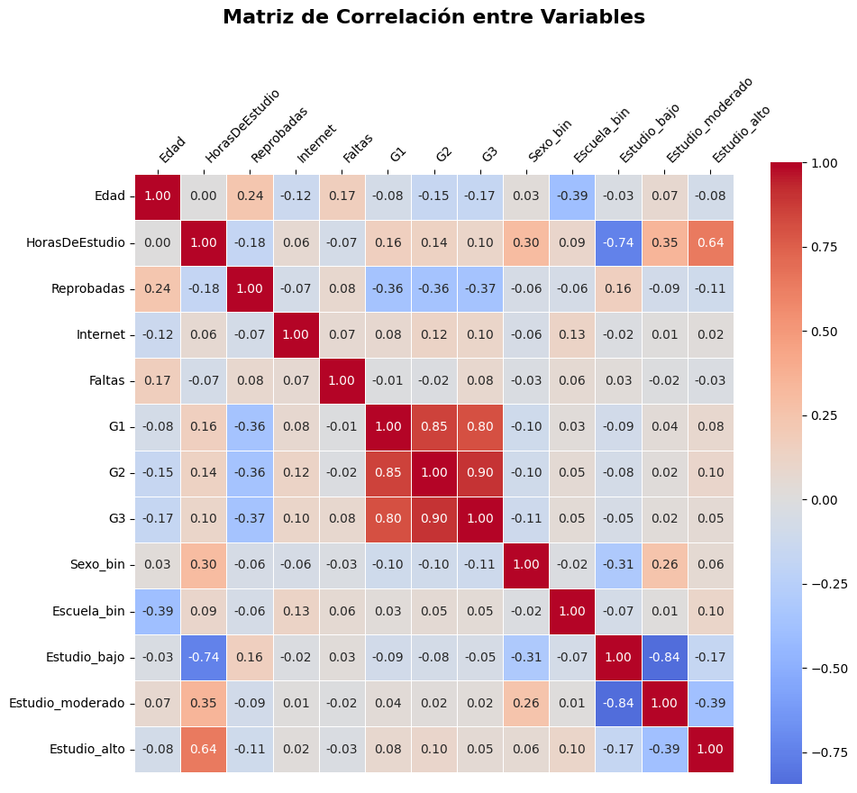

# Análisis de relaciones entre variables

Debido a las problematicas de colinealidad o redundancia de informacion, es importante hacer un analisis para saber si hay 
variables que esten relacionadas entre si o entre la salida, de modo que para eso, podemos ayudarnos de una matriz de correlación 
junto con un heatmap para tener una visualización de estas mismas.

De esta forma podremos ver de forma global si hay relaciones negativas o positivas, asi mismo si estas son fuertes o debiles.


### Crear Matriz de correlación


>Python Code


```python
# Calcular matriz de correlación
correlacion = df.corr()

# Visualización con heatmap
plt.figure(figsize=(10, 10))
sns.heatmap(correlacion,
            annot=True,           # Mostrar valores
            cmap='coolwarm',      # Colores
            center=0,             # Centrar en 0
            fmt='.2f',            # 2 decimales
            square=True,          # Celdas cuadradas
            linewidths=0.5,       # Líneas entre celdas
            cbar_kws={"shrink": 0.8},
            xticklabels=correlacion.columns,  # Etiquetas en X
            yticklabels=correlacion.columns)  # Etiquetas en Y

plt.tick_params(axis='x', labeltop=True, labelbottom=False, top=True, bottom=False)  # Mover etiquetas X arriba
plt.xticks(rotation=45, ha='left')  # Rotar etiquetas
plt.title('Matriz de Correlación entre Variables', fontsize=16, fontweight='bold', pad=40)  # Más espacio para el título
plt.tight_layout()
plt.show()

# Ver las correlaciones con la variable objetivo (G3)
print("="*50)
print("CORRELACIONES CON G3 (Calificación Final)")
print("="*50)
print(correlacion['G3'].sort_values(ascending=False))
```


>Output





```text
==================================================
CORRELACIONES CON G3 (Calificación Final)
==================================================
G3                  1.000000
G2                  0.902882
G1                  0.798394
HorasDeEstudio      0.101594
Internet            0.100722
Faltas              0.084467
Estudio_alto        0.050327
Escuela_bin         0.046183
Estudio_moderado    0.021631
Estudio_bajo       -0.052412
Sexo_bin           -0.112634
Edad               -0.171142
Reprobadas         -0.365408
Name: G3, dtype: float64
```


Interesante matriz, de ella podemos apreciar cierto comportamiento o relacion de los datos que tenemos, 
como por ejemplo, que las variables g1 y g2 estan muy fuertemente relacionadas a la salida,(g3),
esto puede ser algo problematico, ya que al tener una correlacion muy alta, aproximadamente de 0.8 - 90, 
casi estan prediciendo en su mayoria la salida, debido a que conforman una parte de ella por lo que probablemente
tengamos que decidir si incluirlas en el modelo o solo concentrarnos en la calificacion final a partir de las demas variables.

Ademas de eso, podriamos, naturalmente uno podria pensar que entre mas horas de estudio se lleven a cabo, mayor sera la calificacion
final, y si, observamos una correlacion de 0.10 (positiva, pero debil), es decir, si influye, pero no de forma significativa.

Adicionalmente, podemos ver que las variables que acabamos de crear a partir del estudio tienen una correlacion que va en ascendencia,
eso es buena señal.

Fuera de eso, seria muy interesante ver el comportamiento de los datos si usaramos G1 y G2, asi como si los excluyeramos.

### Selección de Caracteristicas

Exploremos los dos casos, de igual forma, naturalmente uno tendra mejor resultado que otro, asi a simple vista, si solo nos concentramos
en la calificacion final (g3), probablemente si excluimos las variables, tendremos una peor prediccion de datos, ya que estariamos quitando 
variables muy criticas para esta estudio.

Si eliminamos ciertas variables (como G1 y G2), las demás variables
tendrán coeficientes (β₁, β₂, etc.) con mayor magnitud. Esto no significa
que estas variables se vuelvan  más importantes, sino que ahora deben "explicar" más varianza en la salida (G3) al no tener el
apoyo de las variables eliminadas. En otras palabras, su contribución
relativa al modelo aumenta para compensar la información perdida.
